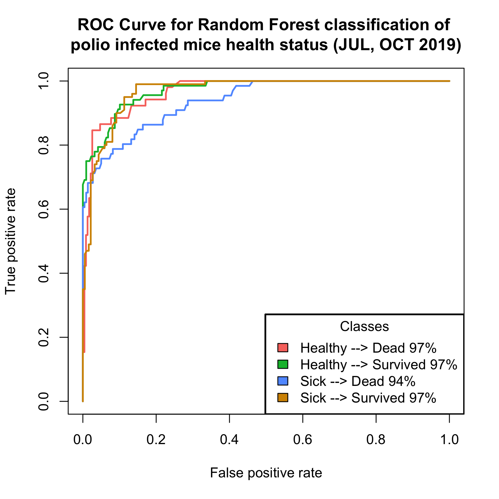

# Mouse types considered for analysis: 

For standardization of analysis methods, we considered using recordings from mice (July 2019 vs October 2019) that are matched for age, virus and infection method. The recording also contains separate batches from UCSF and PC cage types. The data were normalized before subjecting it to time-series decomposition analysis methods.

# Seasonal-Trend decomposition using LOESS (STL)

Seasonal-Trend decomposition using LOESS (STL) is a robust method of time series decomposition that employs locally fitted regression models to decompose a time series into trend, seasonal, and remainder components. The STL algorithm performs smoothing on the time series using LOESS in two loops; the inner loop iterates between seasonal and trend smoothing and the outer loop minimizes the effect of outliers. During the inner loop, the seasonal component is calculated first and removed to calculate the trend component. The remainder is calculated by subtracting the seasonal and trend components from the time series. It is possible to reconstruct the raw time series by simple addition of the trend, seasonality and the remainder components.

The three components of STL analysis relate to the raw time series as follows:

yi = si + ti + ri

where:

yi = The value of the time series at point i.

si = The value of the seasonal component at point i.

ti = The value of the trend component at point i.

ri = The value of the remainder component at point i.

Smoothing for the time series is performed for each feature (temperature, body speed, head body distance, etc) separately. Time series smoothing based on  a jumping average of 3 hours is performed first on all the features and then subjected to STL decomposition to create trend and seasonal component for all the features. 

# Normalized data structure for all the files under healthy and sick condition

The deconvolution was applied to all the sick and healthy mice from both the October and July normalized dataset. Then the trend component and seasonal component were analyzed for patterns using principal component analysis and linear discriminant analysis.

# Re-annotation of mice based on the trend component of the features

Based on the analysis of trend component of various features (only temperature feature shown), we identified some of the mice were mis-annotated to be survived/dead. These mis-annotated mice were re-annotated based on our observations and then subjected to PCA/LDA analysis.

After re-annotation:

Now, we see a clear difference between the mice that survived and dead

**Update:**

The above plot shows by comparing the trend component of the features, it is possibe to identify which mice survived and which one died from the July 2019 data. This was not available earlier, as all mouse were assumed to be dead.

The first plot shows in the old assumption of mice that survived the infection from October 2019 data compared to mice that did not survive from July 2019 data. It is clear that re-annotation (or identifying the survived mouse) is necesssary for the July 2019 data.

The second plot separates from the July2019 data, those mice that survived the infection and those that did not.

# Principal Component Analysis

To explore variation across all features together we will preform PCA and explore variation by time, by mouse and by feature

1. Time

PC1 which accounts for 90% of variance shows separation by time (in days), as well as between mice that died or survived, that is why we will also explore variation by mouse

2. Mouse

4 mice that survived were very different from those that died, overall they cluster together with the healthy (early) days

# Linear Discriminant Analysis

<

Early (first 3 days) vs. late (the rest of the days) vs died/survived

# Random Forest Feature Importance

The accuracy of LDA in classifying the mouse to 8 different categories reaches barely 50%. LDA as a feature reduction method is more applicable for this case than as a classifying algorithm. In order to get the important features that will identify mice that are healthy vs sick and mice that survived vs died, random forest algorithm was used and the important features were identified. 

Select top 3 or 4 features and re-do PCA scatterplot:

# Comparison of the sick mice from july 2019 with healthy mouse from february 2019

## Data smoothing for features (examples):

## STL decomposition of the features based on time series :

## Linear Discriminant Analysis of sick and healthy mice:

<

## Random forest for estimating important features:

Random forest prediction of uninfected and infected mice health status using the trend features of the time series.

## Important features that separates sick and healthy mice:

